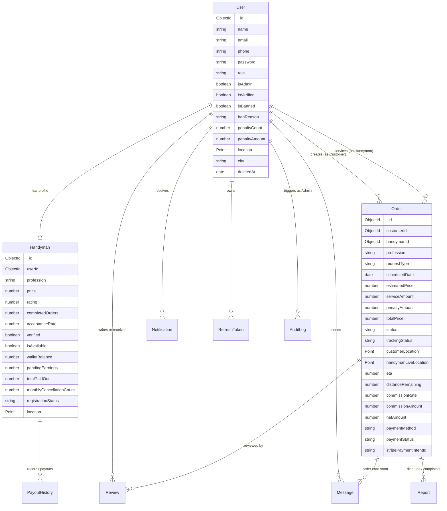
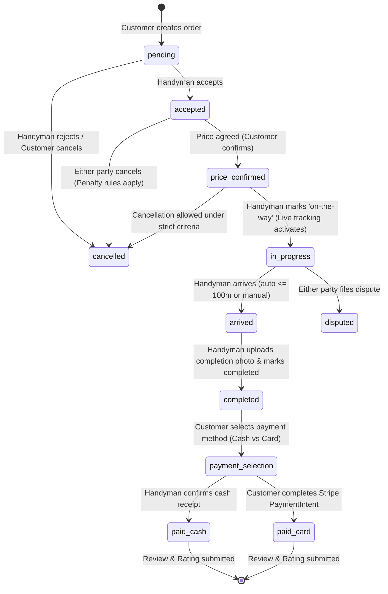
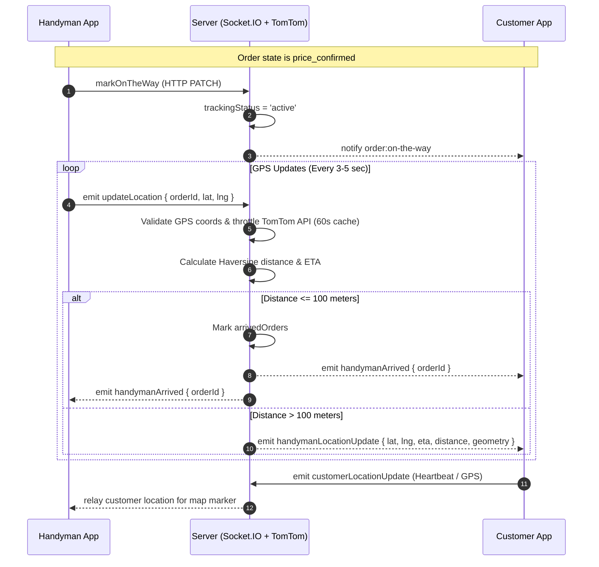
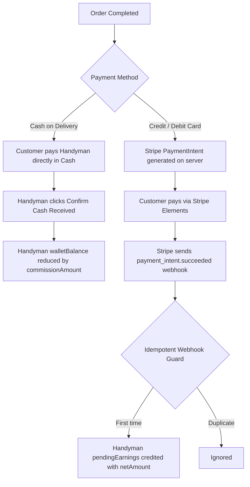

# Comprehensive Deep-Dive Analysis of the Harfey (Herfy) Platform

---

## 1. Executive Summary & Domain Overview

**Harfey (هرفي)** is an on-demand, location-based home services marketplace connecting **Customers** with verified **Handymen / Craftsmen** across various home maintenance disciplines (plumbing, electrical work, carpentry, painting, mechanics, automotive bodywork, etc.) supervised by a centralized **Admin** operations team.

### Primary User Roles & Capabilities

```mermaid
graph TD
    subgraph Users
        C[Customer]
        H[Handyman / Craftsman]
        A[Platform Administrator]
    end

    subgraph Core Features
        C -->|Browse / Discover| Map[Geo-Discovery & Proximity Search]
        C -->|Book| Order[Order Booking & Scheduling]
        C -->|Live View| Tracking[Live GPS Tracking & ETA]
        C -->|Pay| Pay[Stripe Card or Cash Payment]
        C -->|Feedback| Rev[Rating & Reviews]
        
        H -->|Register & Onboard| Verify[KYC Verification & Document Upload]
        H -->|Manage Work| Jobs[Accept / Reject / Confirm Price / In-Progress / Complete]
        H -->|Live Stream| GpsLoc[GPS Broadcast & Route Tracking]
        H -->|Financials| Wallet[Wallet Balance & Earnings Tracking]

        A -->|Review| KYCAdmin[KYC Review & Auto/Manual Verification]
        A -->|Moderate| ModAdmin[Ban / Suspend Handymen & Customers]
        A -->|Finance| FinAdmin[Wallets, Payouts & Commission Settlement]
        A -->|Platform Config| RefAdmin[Manage Cities & Service Types]
        A -->|Disputes| SLAAdmin[SLA Dispute Escalation & Resolution]
        A -->|Audit| AuditAdmin[Immutable Audit Logging]
    end
```


---

## 2. Technical Stack & Repository Topology

The monorepo contains two primary isolated sub-projects:

### 2.1 Backend (`HerfyBackend`)
| Layer / Subsystem | Technology / Package | Version / Description |
| :--- | :--- | :--- |
| **Runtime & Framework** | Node.js (CommonJS), Express | `express ^5.2.1` |
| **Database & ODM** | MongoDB, Mongoose | `mongoose ^9.6.3` |
| **Real-time Engine** | Socket.IO | `socket.io ^4.8.3` |
| **Authentication & Crypto**| JWT, Bcrypt / BcryptJS | `jsonwebtoken ^9.0.3`, `bcrypt ^6.0.0` |
| **Payment Gateway** | Stripe SDK | `stripe ^22.5.0` |
| **Map & Geolocation API** | TomTom Routing API | HTTP client via `axios ^1.18.1` |
| **File Storage** | Cloudinary & Multer | `cloudinary ^1.41.3`, `multer-storage-cloudinary ^4.0.0` |
| **Security & Hardening** | Helmet, MongoSanitize, HPP | `helmet ^8.3.0`, `express-mongo-sanitize ^2.2.0`, `hpp ^0.2.3` |
| **Validation** | Joi | `joi ^18.2.1` |
| **Automated Testing** | Jest, Supertest, MongoMemoryServer | `jest ^29.7.0`, `mongodb-memory-server ^10.4.3`, `supertest ^7.2.2` |

### 2.2 Frontend (`HerfyFrontend_fixed`)
| Layer / Subsystem | Technology / Package | Version / Description |
| :--- | :--- | :--- |
| **Build Tool & Framework**| Vite 8, React 19 | `react ^19.2.6`, `vite ^8.0.12` |
| **Routing** | React Router DOM | `react-router-dom ^7.18.0` |
| **State Management** | Redux Toolkit, React-Redux | `@reduxjs/toolkit ^2.12.0`, `react-redux ^9.3.0` |
| **Styling & Icons** | Tailwind CSS v4, React Icons | `tailwindcss ^4.3.1`, `react-icons ^5.5.0` |
| **Mapping & GIS** | TomTom Web SDK Maps, Leaflet, React-Leaflet | `@tomtom-international/web-sdk-maps ^6.25.0`, `leaflet ^1.9.4` |
| **Client-Side Payments** | Stripe Elements | `@stripe/stripe-js ^9.14.0`, `@stripe/react-stripe-js ^6.8.2` |
| **Real-time Client** | Socket.IO Client | `socket.io-client ^4.8.3` |
| **Localization & i18n** | i18next | `i18next ^26.3.1`, `react-i18next ^17.0.8` (RTL Arabic Support) |

---

## 3. Database Architecture & Data Models

All data is modeled through Mongoose schemas with 2dsphere indexes for geospatial queries:



### Key Models Analysis

1. **[`User`](file:///E:/New%20folder%20%285%29/finalHerfy_fixed/HerfyBackend/models/User.js)**
   - Roles: `'customer'`, `'handyman'`, with `isAdmin: true` boolean distinction.
   - Normalized emails (lowercase) and sparse unique indexing for phone numbers.
   - GeoJSON `Point` with `2dsphere` index for spatial queries.
   - Password hashing via `bcrypt` in pre-save middleware.
   - Integrated soft-delete mechanism (`deletedAt`) to maintain referential integrity.
   - Penalty tracking fields (`penaltyCount`, `penaltyAmount`) to enforce non-payment blocks.

2. **[`Handyman`](file:///E:/New%20folder%20%285%29/finalHerfy_fixed/HerfyBackend/models/Handyman.js)**
   - 1-to-1 link to `User` via `userId` (unique).
   - Approval workflow tracking (`registrationStatus: 'pending' | 'approved' | 'rejected'`).
   - Dual-wallet accounting:
     - `walletBalance`: Net balance owed for cash collections / commissions.
     - `pendingEarnings`: Credit from card-paid orders waiting for admin payout.
   - Monthly cancellation quota enforcement (`monthlyCancellationCount`, `monthlyCancellationMonth`, `monthlyCancellationYear`).

3. **[`Order`](file:///E:/New%20folder%20%285%29/finalHerfy_fixed/HerfyBackend/models/Order.js)**
   - Core transactional document linking Customer and Handyman.
   - Stores origin `customerLocation` and live `handymanLiveLocation`.
   - Comprehensive pricing breakdown: `serviceAmount`, `penaltyAmount`, `totalPrice`, `commissionRate` (10% normal, 15% emergency), `commissionAmount`, and `netAmount`.
   - Status & Payment state machine fields (`status`, `trackingStatus`, `paymentMethod`, `paymentStatus`).

4. **[`Report`](file:///E:/New%20folder%20%285%29/finalHerfy_fixed/HerfyBackend/models/Report.js) & [`AuditLog`](file:///E:/New%20folder%20%285%29/finalHerfy_fixed/HerfyBackend/models/AuditLog.js)**
   - Dispute management with SLA deadline tracking (`slaDeadline`, `isEscalated`).
   - Immutable audit logging for all admin actions (user bans, suspensions, reference data updates, payouts).

5. **[`RefreshToken`](file:///E:/New%20folder%20%285%29/finalHerfy_fixed/HerfyBackend/models/RefreshToken.js) & [`IdempotencyKey`](file:///E:/New%20folder%20%285%29/finalHerfy_fixed/HerfyBackend/models/IdempotencyKey.js)**
   - Cryptographic SHA-256 hashed refresh tokens with MongoDB TTL expiration.
   - Idempotency layer (24h TTL) preventing duplicate order creation or double payment operations.

---

## 4. Order Lifecycle & State Machine

The order execution strictly follows a validated state transition flow:



### Cancellation & Penalty Rules Matrix
| Phase / State | Customer Cancellation | Handyman Cancellation |
| :--- | :--- | :--- |
| **`pending`** | No penalty | Free decline |
| **`accepted`** | Free cancellation | Free cancellation (within monthly limit of 3) |
| **`price_confirmed` (Before on-the-way)** | Free cancellation | Counted against monthly quota |
| **`price_confirmed` (On-the-way active)** | Penalty applied (50 EGP added to user record, order blocked) | Penalty / suspension if excessive (>3/month) |
| **`arrived` / `in-progress`** | Cannot cancel without filing a dispute | Requires dispute filing |

---

## 5. Real-Time Architecture & Live Tracking

The platform uses a hardened real-time engine built on Socket.IO:



### Live Tracking Safeguards
- **GPS Sanitization**: Out-of-bounds latitude/longitude or null island (`[0,0]`) coordinates are strictly rejected.
- **TomTom Route Throttling**: Calculates full polyline and traffic delay with a 60-second in-memory throttle cache per order (`liveTrackingThrottle.js`).
- **Co-located Start Guard**: Protects against immediate false arrivals if the handyman is near the client at job acceptance.
- **Client-Side Route Validation**: `routeValidation.js` on React verifies that TomTom route coordinates accurately connect the handyman's live GPS to the destination before rendering map polylines.

---

## 6. Financial & Payment Systems

### 6.1 Commission & Earnings Calculations
- **Standard Orders**: 10% platform commission (`totalPrice * 0.10`).
- **Emergency Orders** (`isEmergency: true`): 15% platform commission (`totalPrice * 0.15`).
- **Net Calculation**: `netAmount = totalPrice - commissionAmount`.

### 6.2 Cash vs Card Payment Flow


### 6.3 Admin Payout Workflow
- Handymen accumulated `pendingEarnings` from card orders are reviewed by Admin on `/admin/wallets`.
- Admin executes payout: records a new `PayoutHistory` document, clears `pendingEarnings`, increments `totalPaidOut`, and logs an immutable `AuditLog` entry.

---

## 7. Security, Authentication & Authorization

1. **Dual-Token System**:
   - **Access Token**: Short-lived JWT (15-minute expiry) signed with `JWT_SECRET`.
   - **Refresh Token**: High-entropy crypto string stored as a **SHA-256 hash** in MongoDB with automatic rotation upon each refresh request.
2. **Socket Authentication**:
   - Handshake auth token verification in `socketAuth.js`. Banned and soft-deleted accounts are disconnected immediately.
3. **Idempotency Protection**:
   - `idempotencyMiddleware.js` uses the `Idempotency-Key` HTTP header to prevent duplicate charge attempts and order submissions across unstable cellular connections.
4. **Input Sanitization & Protection**:
   - `express-mongo-sanitize` scrubs `$` and `.` operators to prevent NoSQL query injection.
   - `hpp` mitigates HTTP Parameter Pollution.
   - `helmet` configures secure HTTP response headers and CORS cross-origin policies.
   - File uploads are validated via Multer mime-type filters and stored securely on Cloudinary.

---

## 8. Frontend Architecture & Routing Structure

### 8.1 Application Routing Hierarchy (`App.jsx`)
```
/ (WelcomePage)
├── /login, /register, /verify-email, /forgot-password
├── /customer/ (CustomerLayout + ProtectedRoute['customer'])
│   ├── /home (HomePage - service cards, location picker, top handymen)
│   ├── /map (MapPage - interactive map with radius search)
│   ├── /handyman/:id (HandymanProfilePage - reviews, pricing, order trigger)
│   ├── /create-order/:handymanId (CreateOrderPage)
│   ├── /tracking/:orderId (TrackingPage - live TomTom tracking map & ETA)
│   ├── /review/:orderId (ReviewPage)
│   ├── /payment/:orderId (OrderPaymentPage - Stripe checkout)
│   ├── /dashboard, /profile, /notifications, /reports
├── /handyman/ (HandymanLayout + ProtectedRoute['handyman'])
│   ├── /dashboard (HandymanDashboard - availability toggle, monthly stats, targets)
│   ├── /orders (HandymanOrdersPage)
│   ├── /orders/:id (HandymanOrderDetailsPage - tracking trigger, price entry, completion photo)
│   ├── /profile, /notifications, /reports
├── /admin/ (AdminLayout + ProtectedRoute['admin'])
│   ├── /dashboard (AdminDashboard - charts, platform totals, quick stats)
│   ├── /users, /users/:userId (AdminUsersPage & AdminUserDetailPage)
│   ├── /verifications (AdminVerificationsPage - KYC approve/reject/auto-verify)
│   ├── /reports (AdminReportsPage - dispute resolution & SLA tracking)
│   ├── /wallets (AdminWalletsPage - payouts & cash settlement)
│   ├── /reference-data (AdminReferenceDataPage - dynamic cities & service types)
│   ├── /analytics (AdminAnalyticsPage - CSV exports, overview, jobs breakdown)
│   ├── /audit-log (AdminAuditLogPage)
└── /chat/:orderId (ChatPage - customer & handyman real-time messaging)
```

### 8.2 Redux Store Topology
- **`authSlice`**: Stores user authentication state, tokens, user profile, role normalization (`isAdmin` -> `'admin'`).
- **`orderSlice`**: Manages active orders, status updates, price confirmations, and payment states.
- **`handymanSlice`**: Manages handyman profiles, availability toggling, earnings analytics, and KYC status.
- **`chatSlice`**: Handles real-time message feeds, active room state, and typing indicators.
- **`notificationSlice`**: Manages system alerts, unread counts, and notification room subscriptions.
- **`locationSlice`**: Stores client geospatial coordinates, selected address, and radius filters.
- **`adminSlice`**: Manages analytics data, user lists, verification queues, and audit log entries.

---

## 9. Codebase Health & Structural Observations

### Current System Verification Status
1. **Backend Automated Tests**:
   - Passed 53 of 53 tests across all test suites (`cancellation.test.js`, `payment.test.js`).
2. **Frontend Production Build**:
   - `vite build` completed successfully without compilation errors (transformed 200 modules, generated production bundles).

### Key Architectural Notes & Observations
1. **Redundant Directory**:
   - `HerfyFrontend_fixed/src/utlis` is an unused folder (typo directory containing `constants.js`), whereas `HerfyFrontend_fixed/src/utils/` is the active utility directory.
2. **Deprecation Warnings**:
   - Mongoose `new: true` options in `findOneAndUpdate` can be migrated to `returnDocument: 'after'` in future maintenance iterations.
3. **Chunk Splitting**:
   - The frontend main bundle is ~1.89 MB; code splitting via dynamic imports (`React.lazy`) for Admin and Handyman sub-pages will optimize initial load times.
4. **Resilient Geolocation Design**:
   - Separation between authoritative destination (`customerLocation` from DB) and live customer GPS ensures rock-solid TomTom routing and eliminates destination-jumping anomalies.

---

## 10. Summary & Readiness Assessment

The **Harfey** codebase is clean, well-architected, and structured with separation of concerns between business logic, data models, real-time gateways, and UI components. The system has end-to-end coverage of the service marketplace lifecycle—from onboarding and KYC to real-time dispatching, live GPS tracking, and post-service dual-mode payment resolution.
