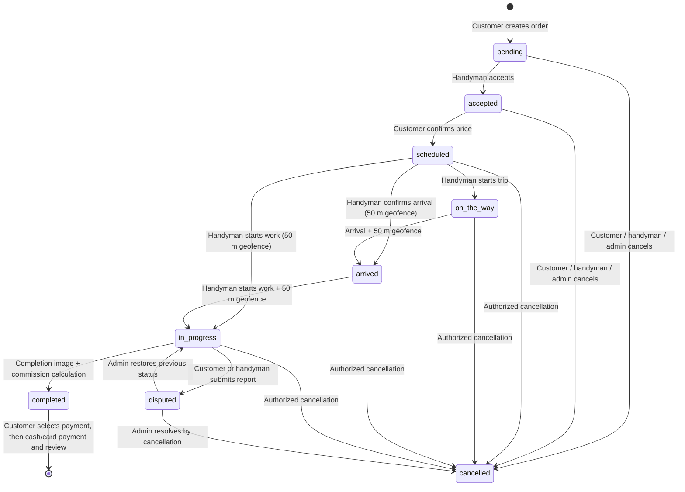

# Harfey: Code-Accurate Defense Guide

> Scope: this guide describes the repository as inspected on 27 August 2026. It deliberately separates **implemented behaviour** from intended behaviour, dependencies that are merely installed, and known code defects. It is not based on the earlier thesis or `HerfyAnalysis.md` where they disagree with source code.

## 1. One-minute project explanation

Harfey is a React/Express/MongoDB marketplace for home-maintenance work. A customer registers, finds an approved available handyman, creates a scheduled or immediate service order, agrees a price, follows the trip, receives the work, then chooses cash or card payment and can review the handyman. Handymen have an approval profile, availability, cancellation penalties, a cash-commission balance, and card-payment earnings awaiting administrator payout. Administrators moderate users, registration records, reports, reference data, and financial records.

The system is a single-page React client (`HerfyFrontend_fixed`) calling an Express REST API and a Socket.IO server (`HerfyBackend`). MongoDB stores the business records. Stripe is used for order card payments and penalty payments, TomTom is used for road routes/ETA, Cloudinary is used for uploads, Nodemailer sends mail, and Google Gemini powers the authenticated assistant.

```text
Customer / Handyman / Administrator browser
                |
 React 19 + Redux Toolkit + Axios + Socket.IO client
                |
      REST (HTTP)              Socket.IO handshake/events
                |                         |
 Express routes -> middleware -> controllers <- socket handlers
                |                         |
             Mongoose / MongoDB       TomTom / Stripe / Cloudinary / Gemini / SMTP
```

There is no Docker, CI/CD, TLS termination, AWS deployment, Redis adapter, or Swagger server implemented in this repository. Those must not be claimed as current infrastructure.

## 2. Repository map and responsibilities

```text
HerfyFrontend_fixed/
  src/App.jsx                  React Router route tree and role layouts
  src/api/axios.js             Axios instance; attaches the stored access token
  src/services/api.js          Named REST calls used by pages/slices
  src/store/                   Redux store and auth/order/chat/location/... slices
  src/socket/socket.js         Singleton authenticated Socket.IO client
  src/pages/                   38 role-specific screen components
  src/components/              layouts, maps, Stripe UI, chatbot, shared UI
  src/hooks/                   `useSocket`, `useCurrentLocation`
  src/utils/                   order-status, geocoding, idempotency and map helpers

HerfyBackend/
  app.js                       Express/HTTP/Socket.IO composition and route mounting
  routes/                      17 physical route modules; HTTP boundary and middleware order
  controllers/                 20 controller files; most business logic is here
  models/                      19 Mongoose collection definitions
  middlewares/                 JWT/RBAC, validation, uploads and idempotency
  socket/                      chat, notifications and live-location event handlers
  utils/tomtom.js              TomTom Routing API adapter
  config/                      MongoDB, Stripe, Cloudinary and Gemini configuration
  validations/                 Joi request schemas
  tests/                       six Jest/Supertest suites, 87 statically discoverable tests
```

The backend is *mostly* route -> middleware -> controller -> Mongoose/external API. There is no general service layer: important rules live in `controllers/orderController.js`, `controllers/handymanController.js`, and the Socket.IO files. That is workable for this size of application, but makes `orderController.js` a large, high-risk module.

## 3. Roles and enforcement

`models/User.js` only permits `role: 'customer' | 'handyman'`. An administrator is a user with `isAdmin: true`; it is **not** a third value of the `role` enum. The frontend normalizes this for layout selection, and `allowedToMiddleware` grants an `isAdmin` user access before testing roles.

| Actor | Main UI | Main actions | Main server enforcement |
|---|---|---|---|
| Customer | `/customer/*`, `/customer/payment/:orderId`, `/chat/:orderId` | profile, discovery, create/cancel order, choose payment, review, report, support | JWT; `allowedToMiddleware('customer')` on selected routes; controller checks `order.customerId` |
| Handyman | `/handyman/*`, `/chat/:orderId` | approved profile, availability, accept, price, trip, completion, cash confirmation, fine settlement | JWT; handyman approval/suspension checks; controller checks `order.handymanId` |
| Admin | `/admin/*` | users, registration, financial records/payout records, reports, analytics, reference data | `authMiddleware` then `allowedToMiddleware('admin')` in `adminRoutes.js`; this accepts `isAdmin` |

`middlewares/authMiddleware.js` verifies `Authorization: Bearer <JWT>`, loads the User, blocks banned/soft-deleted/unverified users, and blocks pending/rejected handyman registrations except for support routes. `checkHandymanActive` additionally requires an approved and non-suspended Handyman document.

Important caveat for a defense: `reportRoutes.js` exposes `GET /api/reports` and `PATCH /api/reports/resolve/:id` with authentication only, even though their controller operations are administrative. Also, several controller checks use `req.user.role === 'admin'`, which cannot be true under the User schema; admin access should consistently use `req.user.isAdmin` or the route middleware.

## 4. Authentication flow

### Registration and verification

1. `RegisterPage.jsx` sends multipart registration data to `POST /api/users/register`.
2. `routes/authRoutes.js` accepts optional documents, normalizes location coordinates, validates with `validations/registerValidationSchema.js`, and calls `registerUser` in `controllers/authController.js`.
3. Password hashing is done by `User`'s pre-save hook with bcrypt cost 10. For handyman registrations, the controller creates the related `Handyman` profile with `registrationStatus: 'pending'`.
4. `sendVerificationEmail.js` sends an email OTP. `POST /api/users/verify-email` marks the User as verified; `resend-otp` resends it.
5. An administrator later approves/rejects the handyman profile through `/api/admin/approve-registration/:handymanId` or `/reject-registration/:handymanId`.

### Login, refresh, logout and password reset

`loginUser` validates credentials with `user.matchPassword`, then `issueTokenPair` creates an access JWT and a random refresh token. `RefreshToken` stores only a SHA-256 hash with expiry/revocation data. `POST /api/users/refresh` rotates this record and issues a replacement; `POST /logout` revokes it. `forgot-password` and `reset-password` use OTP fields on User. The client initializes its session in `components/layout/AuthInit.jsx` and stores/uses the access token through the Redux auth slice and `api/axios.js`.

Why this design: the short-lived JWT proves each request without server session storage; the database-backed refresh-token record gives the project a revocation/rotation mechanism. The access token itself cannot be revoked before expiry.

## 5. Data model: the essential relationships

| Model | Purpose and important links |
|---|---|
| `User` | identity, password, role/isAdmin, verification, GeoJSON location, ban/soft-delete and customer penalty fields; 2dsphere index on `location` |
| `Handyman` | one-to-one extension of User (`userId` is unique): profession, price, rating, availability, approval, GeoJSON base location, wallet/earnings, cancellation counters; 2dsphere index on `location` |
| `Order` | customerId and handymanId both reference User; scheduled date/time, location snapshots/live location, lifecycle, price/commission, payment, tracking and reschedule embedded objects |
| `Review` | references one order, one customer and one handyman; unique compound index `(customerId, orderId)` |
| `Message` | references an order and sender; text/image/audio, seen/deleted flags |
| `Notification` | references user; typed message and JSON data; seven-day TTL via `createdAt` |
| `Report` | references order, reporter, accused user and resolver; stores pre-dispute status and SLA fields |
| `Fine`, `SettlementRequest`, `FinancialRecord`, `PayoutHistory` | penalty and payout audit trail; not a single normalized payment ledger |
| `RefreshToken`, `IdempotencyKey` | refresh-token rotation and cached response support; idempotency records expire after 24 hours |
| `StripePayment`, `StripeSubscription` | separate generic product/cart and subscription records; neither is the core Order payment document |
| `SupportConversation`, `SupportMessage`, `ServiceType`, `AuditLog` | support chat, admin-managed professions, and administrative action audit trail |

MongoDB suits flexible order snapshots, embedded tracking/rescheduling state, and rapid iteration. It does not provide relational foreign-key enforcement: controllers must enforce ownership and related-record consistency.

## 6. Discovery and “smart matching” — exact behaviour

The public endpoint is `GET /api/handyman/nearby` (also mounted under `/api/handymen/nearby`) in `routes/handymanRoutes.js`; its controller is `getNearbyHandymen` in `controllers/handymanController.js`.

Actual algorithm (updated to use the declared geospatial index):

1. Require `lat` and `lng`, validate latitude/longitude ranges.
2. Query Handyman profiles where `registrationStatus: 'approved'`, `isSuspended: false`, and `isAvailable: true`, using `$near` over `Handyman.location` with a GeoJSON Point and `$maxDistance`; optionally match exact `profession`.
3. Populate the linked User and ignore banned/soft-deleted users.
4. Choose the Handyman profile location, falling back to the User location, then calculate great-circle distance with the controller's `haversineDistanceMeters` function.
5. MongoDB discards candidates outside `radius` through `$maxDistance`; the controller caps the radius at the maximum valid spherical distance (20,037,508 metres).
6. If a requested schedule exists, call `checkScheduleConflict` for each candidate; exclude conflicts unless `includeUnavailable=true`.
7. Sort by `distance`, `rating`, `price`, or `smart`. Smart score is: `normalizedDistance * 0.4 + rating/5 * 0.4 + acceptanceRate * 0.2`, unless environment weight overrides are set.

GeoJSON uses `[longitude, latitude]`, and `User.location`/`Handyman.location` have declared `2dsphere` indexes. Discovery now uses `$near` on `Handyman.location`, so MongoDB performs the indexed radius filter and nearest-first candidate retrieval. Haversine remains only for the response display distance and optional smart-score normalization; it is not used to discover every handyman.

## 7. Order state machine and payment point

Intended transitions are defined in `utils/orderConstants.js`:

```text
pending -> accepted -> scheduled/price-confirmed -> on_the_way -> arrived
        -> in-progress -> completed
Any allowed active state can branch to cancelled; disputed can be restored/cancelled by admin.
```

The source has a real inconsistency: `normalizeOrderStatus('price_confirmed')` returns `scheduled`, while `Order.status` and controllers still contain both `price_confirmed` and `scheduled` (plus `on_the_way`/`on-the-way` and `in-progress`/`in_progress`). Explain it as a current code defect, not as two clean persisted stages.

### Order lifecycle — diagram to use in the defense



### What each status means in the current implementation

| Stored/canonical status | Meaning | Main actor/action | Key validation and side effects |
|---|---|---|---|
| `pending` | Newly created request awaiting the assigned handyman | Customer creates the order | Creates Order; may notify the handyman; customer cannot have an outstanding penalty |
| `accepted` | Handyman accepted and may supply a price/duration | Assigned handyman via `PATCH /api/orders/:id/status` | Checks active-order conflict, suspension/penalty, and schedule conflict |
| `scheduled` | The implementation's canonical value after price confirmation | Customer via `PATCH /api/orders/:id/confirm-price` | The code also accepts `price_confirmed`; treat the two names as one business stage |
| `on_the_way` | Handyman has begun the trip | Assigned handyman via `PATCH /api/orders/:id/on-the-way` | Starts `trackingStatus: active`, calculates ETA/expiry, emits notifications/tracking events |
| `arrived` | Handyman is at the service location | Handyman/admin through status endpoint | Requires valid handyman coordinates within `GEO_FENCE_RADIUS_METERS` (50 m by default); stops tracking |
| `in-progress` | Work has started | Handyman/admin through status endpoint or `POST /:id/start` | Requires arrival-compatible state and 50 m geofence; prevents simultaneous active work |
| `completed` | Work is finished, but payment may still be pending | Handyman/admin through status endpoint | Requires `completionImage`; calculates commission, net amount, completion timestamp; payment happens afterward |
| `cancelled` | Order was cancelled | Participant/admin under transition rules | Saves canceller/reason; applies customer or handyman cancellation rules when applicable |
| `disputed` | A participant reported the order for review | Customer or handyman through `POST /:orderId/report` | Saves Report and prior order status; admin resolves to restore/cancel |

### Important distinction: `status` vs `trackingStatus`

`status` is the business state of the job. `trackingStatus` is only the GPS-trip state: `stopped`, `active`, or `expired`. An order can be `on_the_way` while tracking is `active`, and it can remain in a business state even if tracking becomes `expired`. Tracking expiry is **not** completion or cancellation.

### Honest implementation caveat

The diagram expresses the intended/canonical flow. The actual code has mixed aliases (`price_confirmed`/`scheduled`, `on_the_way`/`on-the-way`, and `in-progress`/`in_progress`) and an undeclared `orderAlreadySaved` variable in `updateOrderStatus`. In a defense, say that the lifecycle is implemented with validation but needs status normalization cleanup before production release.

| Operation | Route/controller | Actor | Main effects |
|---|---|---|---|
| Create | `POST /api/orders/create` -> `createOrder` | customer | validates schedule/location/pending penalty; saves pending order and notifies handyman |
| Accept and offer price | `PATCH /:id/status` -> `updateOrderStatus` | assigned handyman | validates state, active jobs, schedule conflicts; increments acceptance data |
| Confirm price | `PATCH /:id/confirm-price` -> `confirmPrice` | customer | changes accepted order to price-confirmed/scheduled representation |
| Depart | `PATCH /:id/on-the-way` -> `markOnTheWay` | assigned handyman | starts tracking, calculates initial ETA/window |
| Arrive/start/complete | `PATCH /:id/status`, `POST /:id/start` | handyman | 50 m geofence for arrival/start; completion requires `completionImage`; calculates commission/net |
| Pay | `PATCH /select-payment-method`, card intent or cash confirmation | customer then Stripe/handyman | payment takes place **after `completed`** |
| Review | `POST /api/reviews/addreview` -> `addReview` | order customer | only completed order; recalculates rating and verification threshold |

`updateOrderStatus` is particularly risky: it assigns `orderAlreadySaved` without declaration. In non-strict CommonJS this can create shared global state. It must be declared locally or removed, then regression-tested.

## 8. Tracking and TomTom

`order.status` describes business work (accepted, arrived, completed); `trackingStatus` independently says `stopped | active | expired`.

`markOnTheWay` starts tracking only from price-confirmed/scheduled/in-progress conditions, records trip fields, computes a departure window, and assigns expiry as initial ETA plus `TRACKING_GRACE_PERIOD_MINUTES` (default 15). `socket/livetracking.socket.js` accepts `joinOrderRoom`, `sendCustomerLocation`, `sendLocation`, `startTracking`, and `stopTracking`. It verifies socket identity/participant access and valid GPS before persisting/relaying location. It keeps in-memory route/trip/arrival state; restart or horizontal scaling loses this state because no Redis/shared adapter exists.

Arrival and service start use Haversine-style geofencing against the stored service coordinate; default radius is `GEO_FENCE_RADIUS_METERS || 50`. Tracking can also emit `trackingExpired`; the socket module has in-memory guards to reduce duplicate emissions for one process.

`utils/tomtom.js:calculateRoute(origin, destination)` calls TomTom `routing/1/calculateRoute/{lat,lng}:{lat,lng}/json` with traffic and fastest car route. It returns road distance, ETA, traffic delay, arrival time and route geometry. On missing key/API failure it returns null routing data and `isFallback: true`; `markOnTheWay` uses a rough 30 km/h Haversine estimate when TomTom does not yield ETA. Mongo proximity and TomTom routing are different: one is straight-line candidate ranking in this code; the other is road navigation/ETA.

## 9. Payments, cancellation and penalties

### Order payments

After completion, customer calls `PATCH /api/orders/:id/select-payment-method`. Card payments use `POST /api/orders/:id/create-payment-intent` in `createStripePaymentIntent`: EGP amount is `round((totalPrice || price) * 100)`, with order/customer/handyman metadata. The Stripe webhook (`POST /api/webhooks/stripe`, raw body/signature verification in `webhookController.js`) atomically changes an unpaid order to paid and credits `Handyman.pendingEarnings` by price minus commission. Duplicate successful webhooks do not re-credit because `findOneAndUpdate` requires `paymentStatus != paid`.

Cash payment is selected after completion, then the assigned handyman calls `PATCH /api/orders/:id/confirm-payment`. It marks paid and adds the commission to `Handyman.walletBalance`. At a 500 EGP wallet balance it suspends the handyman. The generic `POST /api/payments/create-payment-intent` is a different legacy/cart flow: USD, hard-coded products, and `StripePayment`; it is not linked to Order lifecycle.

### Cancellation

In `updateOrderStatus`, customer cancellation from price-confirmed/scheduled/on-the-way/arrived/in-progress creates a progressive outstanding penalty: `50 + penaltyCount * 10`, except if tracking is expired. It saves the amount on User and the order and blocks a new order in `createOrder` while `customer.penaltyAmount > 0`.

For handyman cancellation in the same active states, the monthly count increments and rating drops by 0.5. At the third monthly cancellation, a 50 EGP `Fine` is created and penalty fields increase. This differs from a simple "every cancellation is 50 EGP" story.

Handyman cash fine settlement is a request (`/api/handyman/fines/request-settlement`) which an admin confirms/rejects. Stripe penalty settlement creates/retrieves a dedicated PaymentIntent and, after successful verification/webhook, clears `penaltyAmount` while retaining `penaltyCount`. Database updates are partially atomic, but full cross-document transaction consistency is not guaranteed everywhere.

## 10. Chat, notifications, uploads and Gemini

**Order chat:** REST endpoints in `messageRoutes.js` create/read/delete `Message` records. Socket events in `socket/chatSocket.js` include `joinRoom`, `sendMessage`, `receiveMessage`, `deleteMessage`, `messageDeleted`, `typing`, and support-chat equivalents. Participation is checked against the order/conversation before room access. Messages support text, image and audio; model validation requires text for text messages and a media URL for media messages.

**Notifications:** `createNotification` in `notificationController.js` persists a Notification and emits it to `user_<userId>` if Socket.IO is available. The model has typed events, read status and a seven-day TTL. HTTP routes list, mark one/all read, count unread, and delete. Frontend notification Redux/UI consumes both REST and socket state.

**Uploads:** `middlewares/uploadMiddleware.js` uses Multer/Cloudinary storage and validates configured image/document/audio types/limits. `/api/uploads/image`, `/images`, `/audio`, `/document` call `uploadController.js`. Registration uploads in `authRoutes.js` use a separate memory-storage route and `uploadBufferToCloudinary`; on Cloudinary failure it falls back to a data URI, so do not promise that every file is securely externalized. The frontend must send multipart data without manually forcing a JSON `Content-Type` so the browser sets the multipart boundary.

**Gemini:** `POST /api/chatbot/ask` is authenticated, Joi-validated and rate-limited to 15 requests/minute in `routes/chatbotRoutes.js`. `askChatbot` builds an Arabic platform-scoped system instruction in `chatbotController.js`, fetches active ServiceType names, submits client-supplied history plus message to `@google/genai`, and returns `response.text`. Default model is `gemini-2.5-flash` (`config/gemini.js`). It does not query orders, payments, messages, or private database data; its only dynamic database context is active profession names and the authenticated user's name/role in its prompt.

## 11. Security and production limitations

Implemented controls: bcrypt password hashing; JWT verification; refresh-token hashes; banned/deleted/verification checks; Joi on several inputs; Helmet; explicit CORS allowlist for localhost development URLs; mongo-sanitize; HPP; raw signed Stripe webhook; request idempotency on selected order mutations; ownership checks in many controllers; socket token authentication; upload filtering; and chatbot-only rate limiting.

Important weaknesses to volunteer if asked:

1. Global API rate limiting in `app.js` is commented out.
2. CORS is development-localhost only; no production origin/configuration is shown.
3. Some authorization is duplicated in controllers and inconsistent (`role === 'admin'` vs `isAdmin`); `reportRoutes.js` is a concrete route-level exposure.
4. Matching now uses `$near` and the `Handyman.location` 2dsphere index for candidate retrieval, but scheduled searches still perform one schedule-conflict check per candidate and require pagination/limits for large result sets.
5. Socket tracking/cache state is process memory, so it is not horizontally scalable and disappears on restart.
6. The order status vocabulary is duplicated/inconsistent; `orderAlreadySaved` is undeclared.
7. There are no frontend automated tests, deployment manifests, observability/monitoring, load tests, or verified current pass/fail test run in the repository.
8. `subscriptionController.cancelSubscription` receives an arbitrary subscription ID and does not establish ownership before cancelling it.

## 12. Defense questions: concise high-value answers

| Question | Strong answer |
|---|---|
| Why MongoDB? | Orders contain evolving embedded tracking, rescheduling and payment metadata, and the application uses Mongoose schemas for validation. It trades database foreign keys for controller-enforced references/ownership. |
| Do you use MongoDB geospatial search? | Schemas declare GeoJSON and 2dsphere indexes, but the current nearby controller loads filtered handyman profiles and calculates Haversine distances in Node. It is geospatial *data-ready*, not currently a `$near` implementation. |
| Why longitude before latitude? | GeoJSON coordinates are specified as `[longitude, latitude]`; reversing them places points incorrectly. TomTom's URL uses `latitude,longitude`, so adapters deliberately convert order. |
| Why Socket.IO and REST together? | REST is used for durable commands/queries and standard HTTP errors. Socket.IO distributes low-latency location, chat, typing and notification events to authenticated rooms. |
| When does the customer pay? | The order payment flow starts only after `order.status === 'completed'`; customer selects cash/card. Card confirmation is authoritative through Stripe webhook; cash is confirmed by the assigned handyman. |
| Why PaymentIntent/webhook? | PaymentIntent models asynchronous card completion. The webhook, signature-verified with the raw request body, is the server-side authority for crediting card earnings. |
| How are duplicate Stripe events handled? | Webhook updates only an order whose payment status is not already `paid`; a repeat event gets no matching update and does not credit pending earnings again. |
| How does tracking expire? | `markOnTheWay` stores an expiry based on ETA plus grace period. Socket tracking checks it and emits expiry with in-memory guards; status becomes `expired`, separate from the business order status. |
| Biggest current technical debt? | Consolidate order statuses, repair the undeclared `orderAlreadySaved`, make sensitive routes consistently admin-only, and move matching/tracking shared state toward scalable database/Redis-backed designs. |

## 13. Ten flows to memorize

1. Register -> OTP verification -> handyman admin approval -> JWT login.
2. Customer location -> nearby controller filters profiles -> Haversine/smart sort -> profile page.
3. Create order -> idempotency/validation -> Order pending -> handyman notification.
4. Handyman accepts -> conflict/penalty checks -> price -> customer confirms.
5. Mark on the way -> departure window + TomTom/fallback ETA -> tracking active -> socket room updates.
6. Arrival/start -> server geofence -> order status, trip/tracking fields and notifications.
7. Complete -> completion photo -> commission/net -> status completed.
8. Card payment -> PaymentIntent -> Stripe -> signed webhook -> paid + pending earnings.
9. Cash payment -> handyman confirms -> paid + commission wallet balance/suspension threshold.
10. Cancellation -> actor/state checks -> customer progressive penalty or handyman cancellation counters/fine -> settlement path.

## 14. Final presentation story

“The customer opens the React application and authenticates through the Express API. The API verifies the JWT and the account state, while MongoDB holds the User and service data. The customer searches for an approved and available handyman. In the current implementation the backend filters profiles, calculates straight-line Haversine distance, and can rank candidates with distance, rating and acceptance-rate weights. After an order is created, the assigned handyman accepts it and a price is confirmed. When the handyman travels, the REST action starts tracking and Socket.IO sends authenticated room updates. TomTom provides a road route and ETA when available; server geofencing protects arrival and starting work. On completion, a photo is required and the server calculates commission. Only then does the customer select cash or card. Cash is confirmed by the handyman; card payment is finalized by a Stripe-signed webhook, which prevents duplicate earning credits. Messages, notifications, reports, reviews, uploads and an authenticated Gemini assistant support the workflow. The admin uses a separate protected dashboard for verification, moderation, finance and governance. The main limitations we would address next are status consistency, route authorization, geospatial database querying, test verification, and scalable Socket.IO state.”
