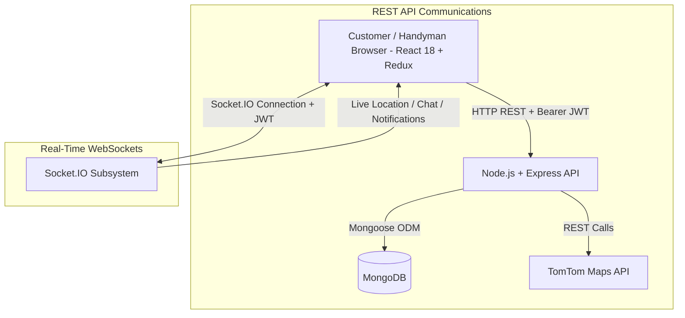
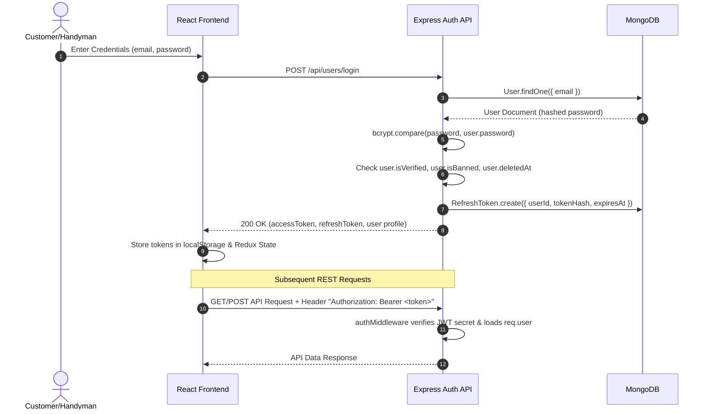
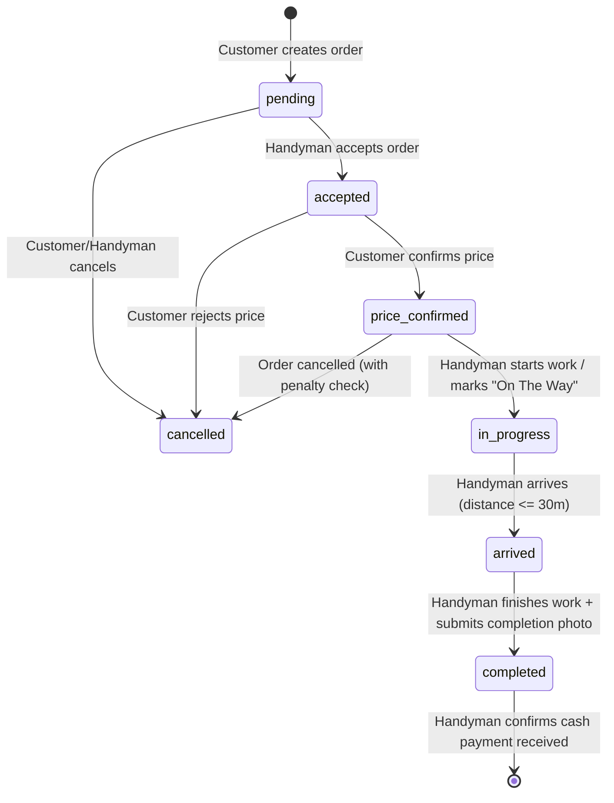

# 📚 Herfy Project — Complete Technical Explanation & System Lifecycle Documentation

> **System Version:** Herfy Platform v1.0  
> **Backend Stack:** Node.js, Express.js, MongoDB (Mongoose ODM), Socket.IO, Nodemailer, Multer  
> **Frontend Stack:** React 18, Vite, Redux Toolkit, Axios, Tailwind CSS, TomTom Maps Web SDK  
> **Purpose:** Technical Architecture, End-to-End Lifecycles, and System Audit Documentation

---

## 📑 Table of Contents
1. [Project Architecture Overview](#1-project-architecture-overview)
2. [Complete Application Startup Lifecycle](#2-complete-application-startup-lifecycle)
3. [Database Lifecycle & Models](#3-database-lifecycle--models)
4. [Authentication & Authorization Lifecycle](#4-authentication--authorization-lifecycle)
5. [Frontend Startup Lifecycle](#5-frontend-startup-lifecycle)
6. [Socket.IO Real-Time Subsystem Lifecycle](#6-socketio-real-time-subsystem-lifecycle)
7. [Order Lifecycle & Status State Machine](#7-order-lifecycle--status-state-machine)
8. [Customer GPS vs Handyman GPS Lifecycles](#8-customer-gps-vs-handyman-gps-lifecycles)
9. [DEDICATED PROOF: Order Destination Immutability (Order A vs Order B)](#9-dedicated-proof-order-destination-immutability-order-a-vs-order-b)
10. [TomTom Routing Lifecycle](#10-tomtom-routing-lifecycle)
11. [Arrival Detection Subsystem](#11-arrival-detection-subsystem)
12. [Tracking Shutdown, Cleanup & Stale State Handling](#12-tracking-shutdown-cleanup--stale-state-handling)
13. [Complete Feature-by-Feature Technical Flows](#13-complete-feature-by-feature-technical-flows)
14. [End-to-End Request Traces](#14-end-to-end-request-traces)
15. [Quick Reference — How the System Works](#15-quick-reference--how-the-system-works)

---

## 1. Project Architecture Overview

The Herfy project is a full-stack, multi-role handyman marketplace designed for three user roles: **Customer**, **Handyman**, and **Admin**. The application uses a hybrid architectural model combining **HTTP/REST APIs** for stateless entity management with a **WebSocket (Socket.IO)** infrastructure for real-time tracking, chat, and notification delivery.

### System Architecture Diagram



### Communication Protocols & Responsibilities

| Subsystem | Technology | Responsibility |
|---|---|---|
| **REST API** | Express.js | Auth, order creation, profile updates, moderation, payments, image upload |
| **WebSocket** | Socket.IO | Live handyman GPS updates, live customer GPS display, chat messaging, push notifications |
| **Database** | MongoDB + Mongoose | Single source of persistent truth for users, orders, ratings, notifications, audit logs |
| **Routing & Maps** | TomTom Web SDK & REST API | Geocoding, polyline route calculation, ETA estimation, map canvas rendering |
| **Background Processing**| node-cron | Periodic dispute escalation checks every 30 minutes |

---

## 2. Complete Application Startup Lifecycle

### Backend Startup Execution Sequence

When the backend is started via `npm run dev` or `node app.js`, execution follows this exact sequence:

```
[app.js Entry] ──> [dotenv.config()] ──> [uncaughtException Guard] ──> [Express App & HTTP Server]
     │
     ├──> [Middleware Stack: CORS, Helmet, BodyParsers, MongoSanitize, HPP]
     ├──> [/uploads Static File Serving]
     ├──> [Socket.IO Server + socketAuth + Registrations: chat, tracking, notification]
     ├──> [Database Connection: connectDB()]
     ├──> [REST Route Registrations: /api/users, /api/orders, /api/handymen, etc.]
     ├──> [Cron Job: startDisputeEscalationJob(io)]
     ├──> [Seeding: ensureSeeded()]
     └──> [Global Error Handler Middleware] ──> [server.listen(port)]
```

#### Detailed Step Breakdown & File References

1. **Environment Configuration**: `[HerfyBackend/app.js:1](file:///c:/Users/abdo/Documents/finalHerfy/HerfyBackend/app.js#L1)` calls `require("dotenv").config()` to populate `process.env` from `.env`.
2. **Process Exception Protection**: `[HerfyBackend/app.js:15-19](file:///c:/Users/abdo/Documents/finalHerfy/HerfyBackend/app.js#L15-L19)` registers `process.on("uncaughtException")` to log fatal errors and perform clean exit.
3. **HTTP Server Instantiation**: `[HerfyBackend/app.js:21-22](file:///c:/Users/abdo/Documents/finalHerfy/HerfyBackend/app.js#L21-L22)` creates Express app `app` and HTTP server `http.createServer(app)`.
4. **Security & Data Sanitization Stack**:
   - `cors()` (`[app.js:28](file:///c:/Users/abdo/Documents/finalHerfy/HerfyBackend/app.js#L28)`): Whitelists frontend origins (`http://localhost:5173`, `http://localhost:5174`).
   - `helmet()` (`[app.js:35](file:///c:/Users/abdo/Documents/finalHerfy/HerfyBackend/app.js#L35)`): Hardens security headers.
   - `express.json({ limit: "10kb" })` (`[app.js:46](file:///c:/Users/abdo/Documents/finalHerfy/HerfyBackend/app.js#L46)`): Restricts body size.
   - `mongoSanitize` (`[app.js:63](file:///c:/Users/abdo/Documents/finalHerfy/HerfyBackend/app.js#L63)`): Sanitizes `req.body`, `req.query`, `req.params` against NoSQL injection.
   - `hpp()` (`[app.js:71](file:///c:/Users/abdo/Documents/finalHerfy/HerfyBackend/app.js#L71)`): Prevents HTTP parameter pollution.
5. **Static File Uploads**: `[HerfyBackend/app.js:94](file:///c:/Users/abdo/Documents/finalHerfy/HerfyBackend/app.js#L94)` mounts `express.static` on `/uploads`.
6. **Socket.IO Instantiation & Authentication**:
   - `const io = new Server(server, { cors: ... })` (`[app.js:99](file:///c:/Users/abdo/Documents/finalHerfy/HerfyBackend/app.js#L99)`).
   - `io.use(socketAuth)` (`[socket/socketAuth.js](file:///c:/Users/abdo/Documents/finalHerfy/HerfyBackend/socket/socketAuth.js)`): Authenticates socket connections via JWT, blocking banned or soft-deleted users.
   - Socket Handlers attached: `registerChatSocket(io)`, `liveTrackingSocket(io)`, `notificationSocket(io)`.
   - `app.set("io", io)` stores instance for REST routes.
7. **Database Pool Connection**: `[config/dbConnection.js](file:///c:/Users/abdo/Documents/finalHerfy/HerfyBackend/config/dbConnection.js)` executes `mongoose.connect(process.env.MONGO_URI)`.
8. **Route Registration**: Mounts 11 REST routers (`authRoutes`, `handymanRoutes`, `orderRoutes`, `reviewRoutes`, `customerRoutes`, `adminRoutes`, `messageRoutes`, `notificationRoutes`, `uploadRoutes`, `referenceRoutes`, `reportRoutes`).
9. **Dispute Cron Job**: `[jobs/disputeEscalation.js](file:///c:/Users/abdo/Documents/finalHerfy/HerfyBackend/jobs/disputeEscalation.js)` initializes `node-cron` schedule `*/30 * * * *` to escalate unresolved disputes past SLA deadline.
10. **Reference Data Seeding**: `[controllers/referenceDataController.js](file:///c:/Users/abdo/Documents/finalHerfy/HerfyBackend/controllers/referenceDataController.js)` seeds professions into `ServiceType` collection on first startup.
11. **Server Listener**: `server.listen(port)` starts listening on port `3000`.

---

## 3. Database Lifecycle & Models

### Core Mongoose Models Summary

| Model File | Collection | Primary Schema Fields | Key Relationships | Indexes |
|---|---|---|---|---|
| `[User.js](file:///c:/Users/abdo/Documents/finalHerfy/HerfyBackend/models/User.js)` | `users` | `name`, `email`, `password`, `role`, `location`, `isBanned`, `deletedAt`, `penaltyCount`, `penaltyAmount` | Referenced by `Order`, `Message`, `Notification`, `Review`, `Report` | `2dsphere` on `location`, `role` |
| `[Handyman.js](file:///c:/Users/abdo/Documents/finalHerfy/HerfyBackend/models/Handyman.js)` | `handymen` | `userId`, `profession`, `price`, `rating`, `isAvailable`, `registrationStatus`, `walletBalance`, `isSuspended` | Foreign key `userId` → `User._id` (1:1) | `2dsphere` on `location` |
| `[Order.js](file:///c:/Users/abdo/Documents/finalHerfy/HerfyBackend/models/Order.js)` | `orders` | `customerId`, `handymanId`, `status`, `customerLocation`, `handymanLiveLocation`, `eta`, `distanceRemaining`, `trackingStatus` | Foreign key `customerId` → `User`, `handymanId` → `User` | `2dsphere` on `customerLocation`, `2dsphere` on `handymanLiveLocation`, `customerId`, `handymanId`, `status`, `trackingStatus` |
| `[Message.js](file:///c:/Users/abdo/Documents/finalHerfy/HerfyBackend/models/Message.js)` | `messages` | `orderId`, `sender`, `type`, `text`, `mediaUrl`, `deleted` | Refers to `Order._id` and `User._id` | `orderId`, `createdAt` |
| `[Notification.js](file:///c:/Users/abdo/Documents/finalHerfy/HerfyBackend/models/Notification.js)` | `notifications` | `userId`, `type`, `title`, `message`, `data`, `isRead` | Refers to `User._id` | `userId`, `isRead` |
| `[Report.js](file:///c:/Users/abdo/Documents/finalHerfy/HerfyBackend/models/Report.js)` | `reports` | `reporterId`, `reportedUserId`, `orderId`, `reason`, `status`, `isEscalated` | Refers to `User` and `Order` | `status`, `isEscalated` |
| `[Review.js](file:///c:/Users/abdo/Documents/finalHerfy/HerfyBackend/models/Review.js)` | `reviews` | `orderId`, `customerId`, `handymanId`, `rating`, `comment` | Refers to `Order` and `User` | `orderId`, `handymanId` |

---

## 4. Authentication & Authorization Lifecycle



### Access Token Refresh Lifecycle (`[axios.js:59-93](file:///c:/Users/abdo/Documents/finalHerfy/HerfyFrontend_fixed/src/api/axios.js#L59-L93)`)
1. Access Tokens expire in 15 minutes.
2. When a request receives an HTTP 401 response, the Axios response interceptor intercepts the error.
3. The interceptor triggers a single silent refresh call `POST /api/users/refresh` sending the stored `refreshToken`.
4. `authController.js` validates the token hash in the `refreshtokens` collection.
5. Upon verification, a new Access Token + rotated Refresh Token pair is returned and saved to `localStorage`.
6. The failed request is automatically retried with the new Access Token.

---

## 5. Frontend Startup Lifecycle

### Mount Sequence

1. `main.jsx` initializes `ReactDOM.createRoot` and wraps the app with Redux `Provider` (`src/store/store.js`).
2. `App.jsx` mounts `BrowserRouter` with `AuthInit.jsx` wrapping all routes.
3. **`AuthInit.jsx` Execution**:
   - Reads `token` & `refreshToken` from `localStorage`.
   - If token exists, dispatches `fetchUserProfile()` thunk (`authSlice.js`) to load user profile into Redux store.
4. **Route Guarding (`ProtectedRoute.jsx`)**:
   - Evaluates `isAuthenticated` and `user.role`.
   - Bounces unauthorized requests to `/login`.
   - Renders layout wrappers (`CustomerLayout`, `HandymanLayout`, `AdminLayout`).
5. **Global Socket Mount (`useSocket.js`)**:
   - Instantiates Socket singleton `connectSocket(token)`.
   - Emits `join-user-room` for push notifications.

---

## 6. Socket.IO Real-Time Subsystem Lifecycle

### Room Architecture
- **Personal User Room (`user_${userId}`)**: Joined upon connection by all authenticated users. Receives notifications and chat messages.
- **Order Room (`${orderId}`)**: Joined by customer and handyman for order tracking and live GPS updates.

### Socket.IO Event Reference Table

| Event Name | Sender | Receiver | Payload | Backend Handler | DB Effect | UI Effect |
|---|---|---|---|---|---|---|
| `joinOrderRoom` | Frontend | Server | `orderId` | `livetracking.socket.js` | None | Client joins order room; triggers location replay |
| `sendLocation` | Handyman | Server | `{orderId, lat, lng}` | `livetracking.socket.js` | Updates `handymanLiveLocation`, `eta`, `distanceRemaining` | Triggers TomTom recalc & broadcasts `locationUpdate` |
| `locationUpdate` | Server | Room | `{lat, lng, customerLat, customerLng, eta, distanceRemaining, geometry}` | `livetracking.socket.js` | None | Handyman marker moves; TomTom polyline redraws |
| `sendCustomerLocation` | Customer | Server | `{orderId, lat, lng}` | `livetracking.socket.js` | In-memory customer location stored | Broadcasts `customerLocationUpdate` to handyman |
| `customerLocationUpdate` | Server | Room | `{orderId, lat, lng, source: "live-gps"}` | `livetracking.socket.js` | None | Displays customer live GPS marker on handyman map |
| `handymanArrived` | Server | Room | `{orderId, msg, eta: 0}` | `emitArrival()` | Sets `order.status = "arrived"`, `trackingStatus = "stopped"` | Displays arrival modal; disables tracking |
| `trackingStarted` | Server | Room | `{orderId, trackingExpiresAt}` | `markOnTheWay` | Sets `trackingStatus = "active"` | Displays active tracking banner and countdown |
| `trackingExpired` | Server | Room | `{orderId, msg}` | `checkAndEnforceTrackingTimeout` | Sets `trackingStatus = "expired"` | Displays tracking session expired notice |

---

## 7. Order Lifecycle & Status State Machine



---

## 8. Customer GPS vs Handyman GPS Lifecycles

### Role of Geolocation Signals

```
                    +-------------------------------------------------------------+
                    |                      GPS DATA SIGNALS                       |
                    +-------------------------------------------------------------+
                                                   |
         +-----------------------------------------+-----------------------------------------+
         |                                         |                                         |
         v                                         v                                         v
+------------------------+             +------------------------+             +------------------------+
|    Handyman Live GPS   |             |   Customer Live GPS    |             | Order.customerLocation |
|     (watchPosition)    |             |    (watchPosition)     |             |      (MongoDB DB)      |
+------------------------+             +------------------------+             +------------------------+
         |                                         |                                         |
         | Dynamic Origin                          | Display Marker ONLY                     | IMMUTABLE Target
         v                                         v                                         v
 [TomTom Route Origin]                     [Handyman Map Marker]                     [TomTom Route Destination]
 [Moving Handyman Marker]                                                            [Arrival Detection Target]
```

---

## 9. DEDICATED PROOF: Order Destination Immutability (Order A vs Order B)

### Core Business & Architectural Principle

> **CRITICAL SYSTEM GUARANTEE**:
> `order.customerLocation` is the **IMMUTABLE** destination captured when an order is created.
> The customer's live GPS coordinates emitted during tracking are stored purely for map marker display and **MUST NEVER** overwrite or replace `order.customerLocation` for TomTom route calculation, ETA generation, or arrival detection.

### Concrete Scenario & Technical Proof

#### Scenario Setup:
1. **Order A Created**:
   - Customer creates Order A while standing at **Location A** (`[30.0444, 31.2357]`).
   - MongoDB document created:
     ```json
     {
       "_id": "Order_A_ID",
       "customerLocation": {
         "type": "Point",
         "coordinates": [31.2357, 30.0444]
       },
       "status": "price_confirmed"
     }
     ```

2. **Customer Moves to Location B**:
   - During active tracking of Order A, the customer walks or drives to **Location B** (`[30.0600, 31.2500]`).
   - The customer app emits Socket event `sendCustomerLocation` with Location B (`lat: 30.0600, lng: 31.2500`).

3. **Backend Source Code Verification (`[livetracking.socket.js:86-104](file:///c:/Users/abdo/Documents/finalHerfy/HerfyBackend/socket/livetracking.socket.js#L86-L104)`)**:
   ```javascript
   const resolveCustomerDestination = (order, roomStr) => {
     // FIXED destination: always use order.customerLocation
     // Customer live GPS (liveCustomerLocations) is stored for display only and
     // must NEVER become the route or arrival destination.
     if (
       order.customerLocation &&
       Array.isArray(order.customerLocation.coordinates) &&
       order.customerLocation.coordinates.length === 2
     ) {
       const [customerLng, customerLat] = order.customerLocation.coordinates;
       if (Number.isFinite(customerLat) && Number.isFinite(customerLng)) {
         return { lat: customerLat, lng: customerLng, source: 'order-db' };
       }
     }
     return null;
   };
   ```

4. **Result for Order A**:
   - Customer's live GPS (Location B) is broadcast to the handyman as `customerLocationUpdate` to render a customer icon on the map.
   - **TomTom Route Destination for Order A**: Location A (`order.customerLocation`).
   - **Arrival Target for Order A**: Location A (`order.customerLocation`).
   - **Order A remains anchored to Location A regardless of customer movement.**

5. **Order B Created at Location B**:
   - Later, the customer creates Order B while at **Location B**.
   - MongoDB document created:
     ```json
     {
       "_id": "Order_B_ID",
       "customerLocation": {
         "type": "Point",
         "coordinates": [31.2500, 30.0600]
       },
       "status": "pending"
     }
     ```
   - When Order B reaches active tracking, `resolveCustomerDestination` resolves Location B from `Order_B_ID`'s `customerLocation`.
   - **TomTom Route Destination for Order B**: Location B.
   - **Arrival Target for Order B**: Location B.

### Comparison Table: `order.customerLocation` vs Customer Live GPS

| Property | `order.customerLocation` | Customer Live GPS (`sendCustomerLocation`) |
|---|---|---|
| **Storage** | MongoDB `orders` collection (`2dsphere`) | In-memory Map (`liveCustomerLocations`) |
| **Immutability** | **IMMUTABLE** for the entire lifecycle of the order | Ephemeral & transient |
| **TomTom Routing Target** | **YES** (Sole authoritative destination) | **NO** (Strictly forbidden) |
| **Arrival Detection Target** | **YES** (Handyman must reach this point) | **NO** |
| **Purpose** | Service destination address | Real-time customer visual marker |

---

## 10. TomTom Routing Lifecycle

```
[Handyman Socket sendLocation] ──> [Extract Handyman Coords (Origin)]
                                              │
[Resolve Fixed order.customerLocation] ──> [Extract Order Coords (Destination)]
                                              │
 [Check 60s Throttle & Cache Validity] ──> Should recalculate?
                                              │
                   ├──────────────────────────┴──────────────────────────┐
                   ▼                                                     ▼
           [YES: Recalculate]                                  [NO: Use Cached Polyline]
                   │                                                     │
   Call TomTom REST API (calculateRoute)                     Read from lastTrustedRouteData Map
                   │                                                     │
                   └──────────────────────────┬──────────────────────────┘
                                              ▼
                           [Broadcast locationUpdate to Order Room]
                                              │
                           [TrackingMap.jsx re-draws Polyline]
```

---

## 11. Arrival Detection Subsystem

- **Distance Metric**: Haversine distance formula (`haversineMeters` in `livetrackingHelpers.js`).
- **Threshold**: 30 meters (`ARRIVAL_THRESHOLD_METERS = 30`).
- **Anti-False Arrival Guard (`shouldAllowArrival`)**:
  - Checks `arrivalTripState` for trip progress.
  - If handyman starts order already inside the 30m circle, requires handyman to move or log minimum tracking updates before arrival triggers, preventing instant false arrivals upon clicking "On The Way".
- **Trigger Execution (`emitArrival`)**:
  1. Sets `order.status = "arrived"`, `order.trackingStatus = "stopped"`.
  2. Emits Socket event `handymanArrived` to room `${orderId}`.
  3. Clears route cache maps (`lastTrustedRouteData`, `liveCustomerLocations`, `lastHandymanLocations`).

---

## 12. Tracking Shutdown, Cleanup & Stale State Handling

Tracking terminates automatically when any of the following occur:
1. **Handyman Arrival**: Distance <= 30m triggers `emitArrival()`.
2. **Order Completed / Cancelled**: `updateOrderStatus` sets status and cleans up throttle.
3. **Tracking Expiration**: `checkAndEnforceTrackingTimeout` checks `Date.now() >= order.trackingExpiresAt`. If expired, transitions `trackingStatus` to `"expired"` and emits `trackingExpired`.
4. **Frontend Unmount**: `TrackingPage.jsx` clears `watchPosition` and removes socket listeners.

---

## 13. Complete Feature-by-Feature Technical Flows

### Feature 1: Handyman Verification & Moderation
- **Frontend Files**: `RegisterPage.jsx`, `AdminVerificationsPage.jsx`.
- **Backend Files**: `authController.js`, `adminControllers.js`, `uploadMiddleware.js`.
- **Flow**: Handyman uploads national ID and certificate via Multer (`uploadMiddleware.js`). `Handyman` record created with `registrationStatus: "pending"`. Admin reviews documents in `AdminVerificationsPage.jsx` and calls `PUT /api/admin/verify-handyman/:id` to approve account.

### Feature 2: Cash Payment & Wallet Suspension
- **Frontend Files**: `HandymanOrderDetailsPage.jsx`.
- **Backend Files**: `orderController.js` (`confirmCashPayment`).
- **Flow**: Handyman confirms receiving cash. Order `paymentStatus` set to `"paid"`. Customer penalty cleared. Platform commission added to handyman's `walletBalance`. If `walletBalance >= 500 EGP`, handyman `isSuspended` set to `true`.

---

## 14. End-to-End Request Traces

### Trace: Handyman Location Update (`sendLocation` Socket Event)

```
Handyman Device (watchPosition)
   │
   ▼ (emits Socket event 'sendLocation')
livetracking.socket.js
   │
   ├──> Validates coordinates (isValidHandymanGps)
   ├──> Checks order status & trackingStatus ('active')
   ├──> Updates order.handymanLiveLocation in MongoDB
   ├──> Resolves fixed order.customerLocation (Destination)
   ├──> Calculates direct distance (haversineMeters)
   │
   ├──> Is distance <= 30m? ──(YES)──> emitArrival() ──> Status = "arrived"
   │                                                         │
   └──(NO)──> Calls TomTom API (or reads cache)              ▼
                     │                             [Emit handymanArrived]
                     ▼
           [Emit locationUpdate to Room]
                     │
                     ▼
           Customer TrackingMap.jsx (Marker moves & Polyline redraws)
```

---

## 15. Quick Reference — How the System Works

1. **Order Placed**: Customer selects handyman & location → `Order` document created with immutable `customerLocation` (Location A).
2. **Order Accepted**: Handyman accepts order → Price confirmed by customer.
3. **Trip Starts**: Handyman taps "On The Way" → `trackingStatus` becomes `active`.
4. **Live Tracking**: Handyman browser sends GPS via Socket `sendLocation` → Backend calls TomTom routing from Handyman GPS to immutable `customerLocation` → Broadcasts `locationUpdate` to customer.
5. **Customer Moves**: Customer live GPS sent to backend → Displayed as customer icon on map **WITHOUT** altering TomTom routing destination.
6. **Arrival**: Handyman reaches 30m radius of `customerLocation` → System emits `handymanArrived` and stops tracking.
7. **Completion & Payment**: Handyman uploads completion photo → Customer pays cash → Handyman confirms payment → Commission credited to platform wallet.
